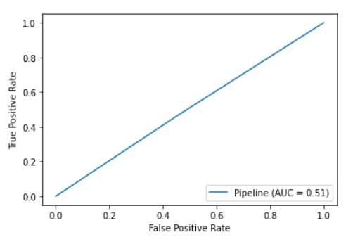
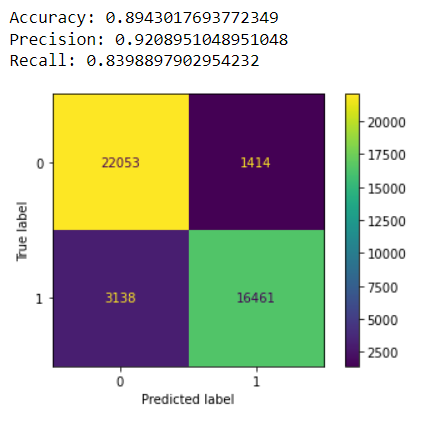
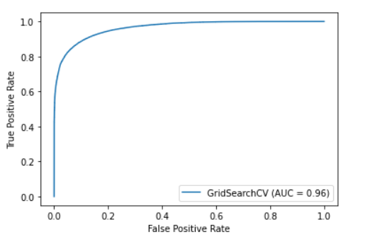
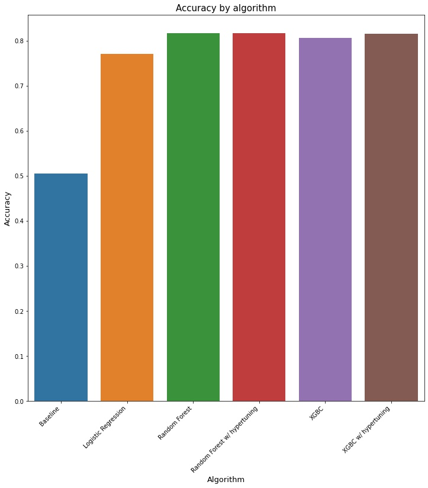
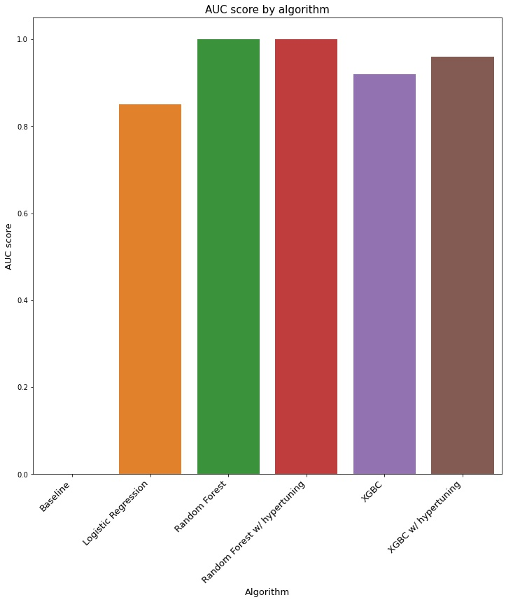
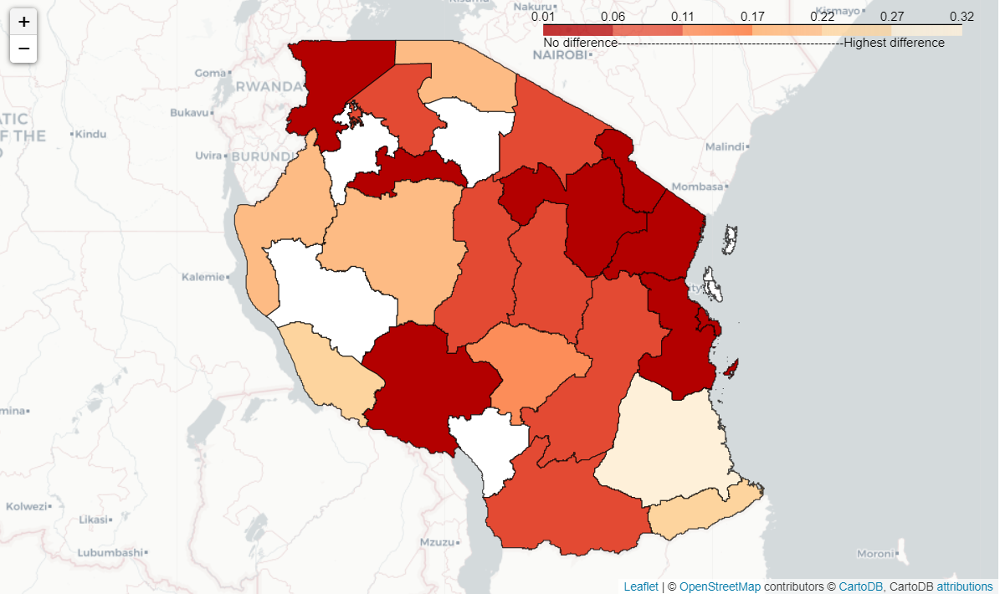
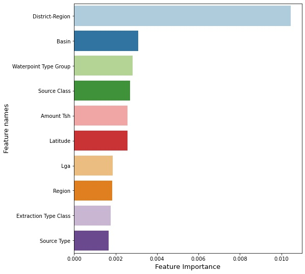
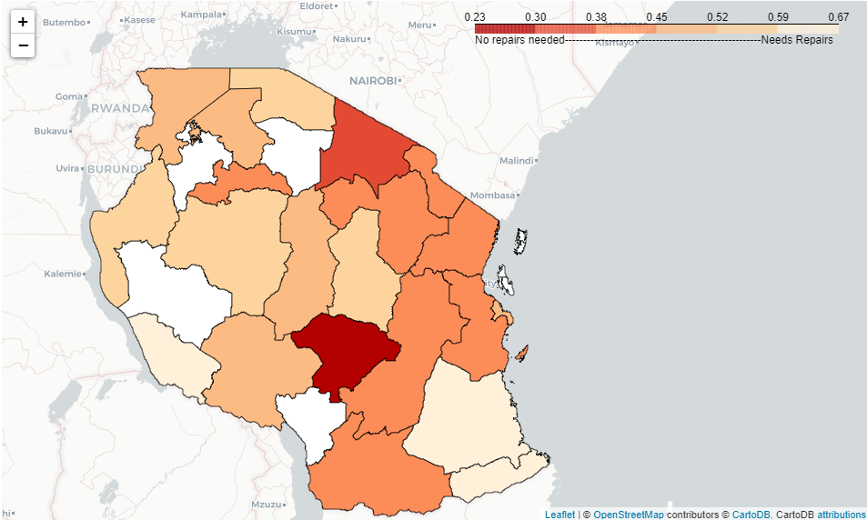

# Predicting water well functionality in Tanzania

**Authors:** [Hanis Zulmuthi](https://github.com/hanis-z)

March 2022


## Business Problem

The Ministry of Natural Resources of Tanzania is starting an initiative to improve their responsiveness and preparedness to water well malfunctions. The analysts from Global Water Alliance is building a Machine Learning model that helps predict whether a water well needs repairs or not. With this predictive model, the government can prepare the resources needed to do the repairs, from materials and communicating with the well’s funders and installers to attend to the water wells before it malfunctions. This way we can avoid water disruptions in communities and ensure they always have access to clean water.

## Data Understanding

The data is attained through competition on [DrivenData](https://www.drivendata.org/competitions/7/pump-it-up-data-mining-the-water-table/page/23/). 

The dataset contains 57,000 records of water wells in Tanzania. There are 40 [features](feature_info.md) in the dataset and our target feature for our predictive model is `status_group`. 

The original dataset has been pre-processed and cleaned in this [notebook](https://github.com/hanis-z/Tanzania-Water-Well/blob/main/Preprocessing.ipynb) and loaded in here for modelling.

## Results
### Modeling Results 
#### Baseline - Dummy Regressor

The first step in doing our analysis here was to create a baseline model using SKLearn's DummyClassifier model. Our predictive models predict 1 if a water well needs maintenance and 0 if it doesn’t need maintenance.Our baseline model has an accuracy of 0.5 which means it predicts well status correctly 50% of the time. 




#### Best Model - XGBoost Classifier w/ Hypertuning

Our 5th model which is a XGBoost Classifier that is hypertuned is by far our best model with an accuracy score of 89% and a higher AUC score of 0.96.







### Modeling Performance




Our best model has an accuracy of 89% and this heatmap shows the average difference between the actual well status vs predicted well status by region. White colors are regions we don't have data for. Darker colors represent no to minimal difference and lighter colors show bigger difference with the biggest difference being 0.32. Given that our well status is a value of 1 or 0, an average difference of 0.32 between actual and predicted well status tells us that our model performed well with room for improvements. 




## Next Steps & Conclusion

Our model has the ability to tell us which features in the model have the utmost importance in making the predictions. This bar chart illustrates the top 10 most important features. At the very top is the district-region code. There are multiple spatial features other than district-region code on this top 10 list such as which basin the well sourced its water and latitude. This tells us that the location of water wells plays a big role in well status.





This heatmap of average of actual well status by region shows some pattern in well status. White are regions without data, darker colors means no repairs and lighter color means repairs needed. We’d love to continue to partner with the Tanzanian Ministry of Water to do more comprehensive spatial analysis to see if a region is more prone to water well malfunctions. This way, the government invests more resources for maintenance in that region. With more time, data and brain power, I would like to include meteorological data in our prediction model to make better predictions and assess whether seasons and weather play a role in water well needing more maintenance or not.

Again, we hope the predictive models could support the government of Tanzania to improve their responsiveness in water accessibility in Tanzania, by predicting whether a well needs repair or not before it needs repair. 

This is so that the government can prepare the resources needed to do the repairs, from materials and communicating with the well’s funders and installers and attend to the water wells before it breaks down. This way we can avoid water disruptions in communities and ensure they always have access to clean water.


## Repository Structure
  ```
├── data
│     ├── features_training.csv
│     ├── gadm36_TZA_1.geojson
│     ├── processed.csv
│     ├── target_training.csv
│     ├── test_data.csv
│ 
├── figures
├── .gitignore
├── LICENSE
├── Modeling.ipynb
├── Preprocessing.ipynb  
├── README.md
├── Tanzania Water Well.pdf
├── feature_info.md


  ```
